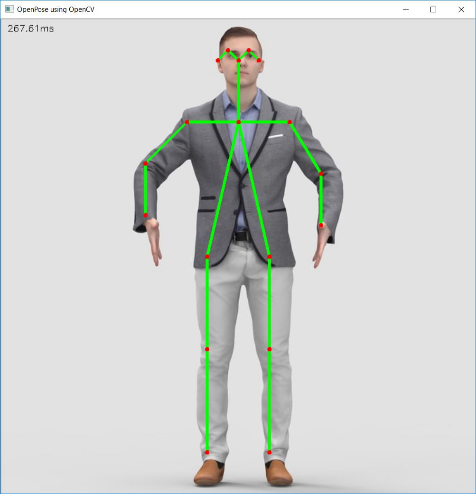

# human-pose-estimation-opencv
Perform Human Pose Estimation in OpenCV Using OpenPose MobileNet




# How to use

- Test with webcam

```
python openpose.py
```

- Test with image
```
python openpose.py --input image.jpg
```

- Use `--thr` to increase confidence threshold

```
python openpose.py --input image.jpg --thr 0.5
```

# Notes:
- I modified the [OpenCV DNN Example](https://github.com/opencv/opencv/blob/master/samples/dnn/openpose.py) to use the `Tensorflow MobileNet Model`, which is provided by [ildoonet/tf-pose-estimation](https://github.com/ildoonet/tf-pose-estimation/tree/master/models/graph/mobilenet_thin), instead of `Caffe Model` from CMU OpenPose. The original `openpose.py` from `OpenCV example` only uses `Caffe Model` which is more than 200MB while the `Mobilenet` is only 7MB.
- Basically, we need to change the `cv.dnn.blobFromImage` and use `out = out[:, :19, :, :]` to get only the first 19 rows in the `out` variable.